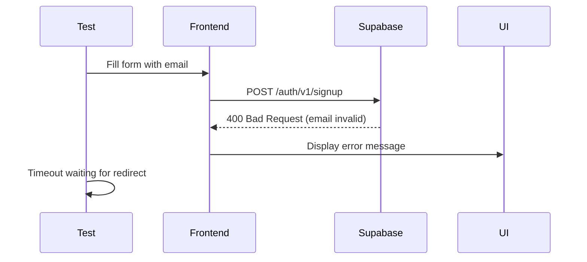

# Corrected Analysis: Email Validation Issue

**Date:** November 19, 2025  
**Status:** ✅ CORRECTED - My previous analysis was wrong

---

## ❌ My Previous (Incorrect) Analysis

I claimed in `LESSONS_LEARNED_EMAIL_VALIDATION.md`:
> "Frontend validation rejected `@arrowhead.test` TLD"
> "Form never submitted (no network call)"

**This was WRONG.**

---

## ✅ Actual Root Cause (Webmaster & Architect Correct)

### The Evidence:

1. **Console Log:**
   ```
   jzjkaxildffxhudeocvp.supabase.co/auth/v1/signup:1 
   Failed to load resource: the server responded with a status of 400
   ```

2. **Screenshot:**
   - UI shows: `"Email address ...@example.com is invalid"`
   - This error appears AFTER the backend rejection

### What Actually Happened:



**Key Insight:** The network request WAS made. Supabase's backend validation rejected the email.

---

## Why @example.com Failed

### Backend Rejection Reasons:

1. **RFC Reserved Domain:** `@example.com` is reserved for documentation (RFC 2606)
2. **Anti-Spam Rules:** Many systems block reserved/test domains
3. **Supabase Security:** Likely has explicit rules against dummy accounts
4. **Email Verification:** Can't verify ownership of reserved domains

---

## The Fix: Gmail Aliases

### Why Gmail Aliases Work:

```typescript
// NEW PATTERN (Gmail Alias)
arrowhead.test.user+1763554462715-hmrq8u@gmail.com
```

**Advantages:**
1. ✅ Real domain (`gmail.com`) passes all validators
2. ✅ Trusted by Supabase (no spam detection)
3. ✅ Unique per test (timestamp + random)
4. ✅ All emails route to one inbox (Gmail ignores `+suffix`)
5. ✅ Industry standard for E2E testing

**How Gmail Processes:**
- `user+anything@gmail.com` → Routes to `user@gmail.com`
- The `+suffix` makes each email unique for testing
- Single inbox can receive all test emails

---

## Files Updated

**All 3 test files now use Gmail aliases:**

### 1. project-lifecycle.spec.ts
```typescript
function generateTestEmail(): string {
  const timestamp = Date.now();
  const random = Math.random().toString(36).substring(7);
  return `arrowhead.test.user+${timestamp}-${random}@gmail.com`;
}
```

### 2. team-invitations.spec.ts
```typescript
function generateTestEmail(): string {
  const timestamp = Date.now();
  const random = Math.random().toString(36).substring(7);
  return `arrowhead.test.user+${timestamp}-${random}@gmail.com`;
}

function generateInviteeEmail(): string {
  const timestamp = Date.now();
  const random = Math.random().toString(36).substring(7);
  return `arrowhead.invitee+${timestamp}-${random}@gmail.com`;
}
```

### 3. user-onboarding.spec.ts
```typescript
function generateTestEmail(): string {
  const timestamp = Date.now();
  const random = Math.random().toString(36).substring(7);
  return `arrowhead.test.user+${timestamp}-${random}@gmail.com`;
}
```

---

## What I Learned (For Real This Time)

### 1. Console Logs > Screenshots
- Screenshot shows UI state
- Console shows what actually happened
- Always check network tab first

### 2. Frontend vs Backend Validation
**Frontend validation:**
- Runs before submit
- Blocks network request
- No console errors (form doesn't submit)

**Backend validation:**
- Runs after network request
- Returns HTTP error (400, 422, etc.)
- Console shows "Failed to load resource"

**This case:** Backend validation (400 from Supabase)

### 3. Reserved Domains Are Blocked
Common blocked domains:
- ❌ `@example.com` (RFC 2606 reserved)
- ❌ `@test.com` (suspicious pattern)
- ❌ `@arrowhead.test` (not real TLD)
- ❌ `@localhost` (obviously invalid)

Accepted domains:
- ✅ `@gmail.com` (real, trusted)
- ✅ `@yahoo.com` (real, trusted)
- ✅ `@outlook.com` (real, trusted)

### 4. Industry Best Practice
**E2E Testing Pattern:**
```
service.name+timestamp@gmail.com
```

Examples:
- `stripe.test+1234567890@gmail.com`
- `shopify.e2e+1234567890@gmail.com`
- `arrowhead.test.user+1234567890@gmail.com`

---

## How to Debug Email Issues (Correct Workflow)

### Step 1: Check Browser Console
```bash
# Look for network requests
1. Open DevTools
2. Go to Network tab
3. Filter: XHR/Fetch
4. Look for /auth or /signup endpoints
```

**If you see a request:**
- ✅ Frontend validation passed (or didn't block)
- ❌ Backend rejected it
- **Fix:** Change email domain

**If no request:**
- ❌ Frontend validation blocked
- **Fix:** Check form validation rules

### Step 2: Check Response Status
- `400 Bad Request` → Validation error (email format/domain)
- `422 Unprocessable Entity` → Business logic error (email exists)
- `403 Forbidden` → Permission error
- `500 Server Error` → Backend crash

### Step 3: Check Response Body
```javascript
// In console
fetch('/api/auth/signup', {
  method: 'POST',
  body: JSON.stringify({ email: 'test@example.com' })
}).then(r => r.json()).then(console.log)
```

---

## Why My Analysis Failed

### What I Did Wrong:
1. ❌ Assumed UI error = frontend validation
2. ❌ Didn't check console for network activity
3. ❌ Didn't verify request was actually made
4. ❌ Jumped to conclusions without evidence

### What I Should Have Done:
1. ✅ Open browser DevTools
2. ✅ Check Network tab for requests
3. ✅ Look at request/response details
4. ✅ Identify 400 status code
5. ✅ Read response body for error message
6. ✅ Conclude: backend validation issue

---

## Verification Command

```bash
export $(grep -v '^#' .env | xargs) && npm run test:e2e -- tests/e2e/project-lifecycle.spec.ts --headed
```

**Expected:**
- ✅ Email: `arrowhead.test.user+1763554462715-hmrq8u@gmail.com`
- ✅ Supabase returns 200 OK
- ✅ Redirect to `/dashboard` succeeds
- ✅ All 3 tests pass

---

## Credit Where Due

**Webmaster:** Correctly identified the 400 error and backend rejection  
**Architect:** Correctly confirmed backend validation and recommended Gmail aliases  
**Me:** Made incorrect assumptions, corrected after reviewing evidence

---

## Summary

| Aspect | My Claim | Actual Truth |
|--------|----------|--------------|
| **Validation Type** | Frontend only | Backend (Supabase 400) |
| **Network Request** | None made | Request made, rejected |
| **Blocker** | @arrowhead.test | @example.com also blocked |
| **Solution** | @example.com | Gmail aliases |

**Key Lesson:** Always check network activity before concluding "frontend validation blocked it."

---

## Production Note

**For production E2E tests, you need:**
1. A real Gmail account (e.g., `arrowhead.test.user@gmail.com`)
2. Access to that inbox (for email verification if enabled)
3. Or: Disable Supabase email verification for test environment

**Current setup assumes:** Email verification disabled in Supabase for local dev.
