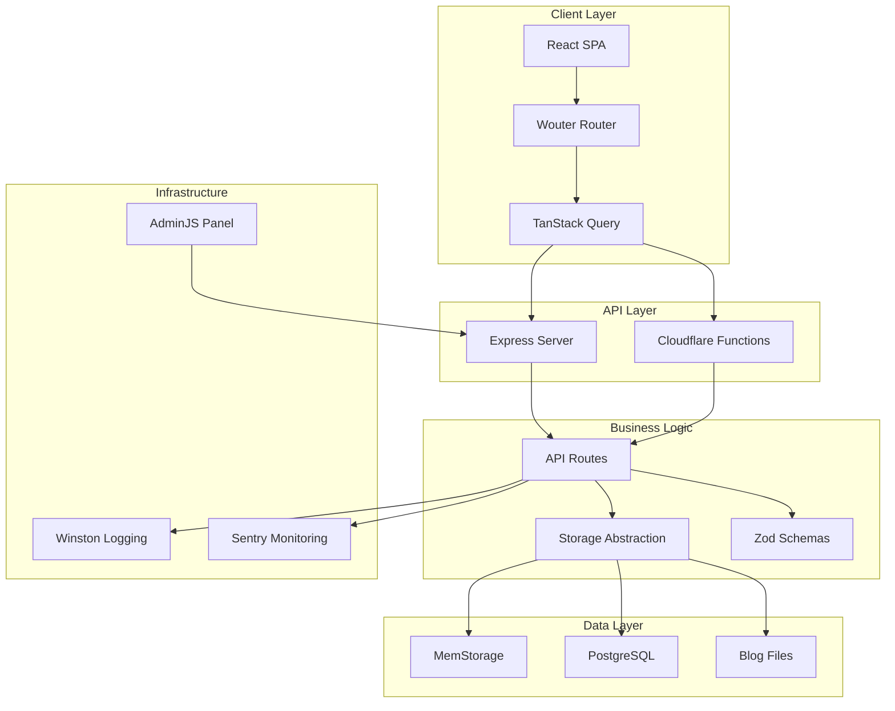
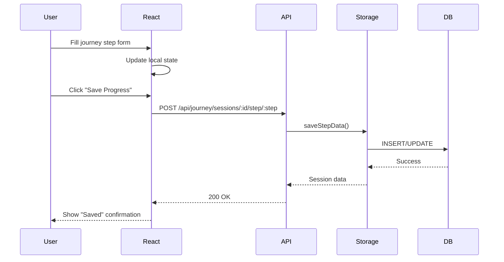
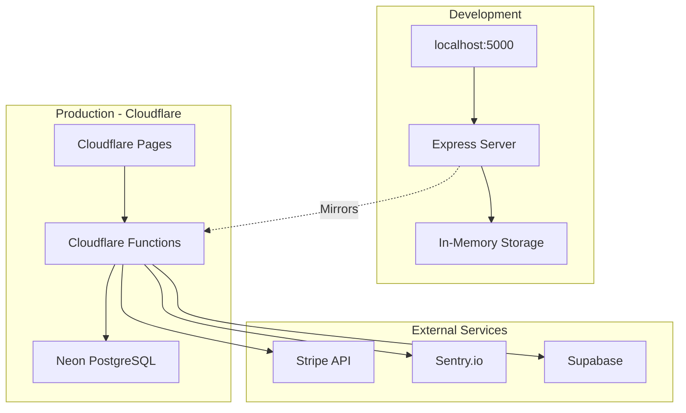
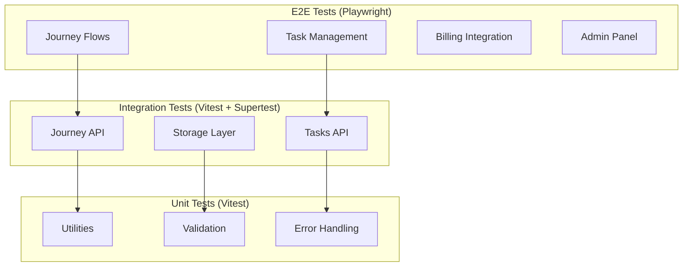
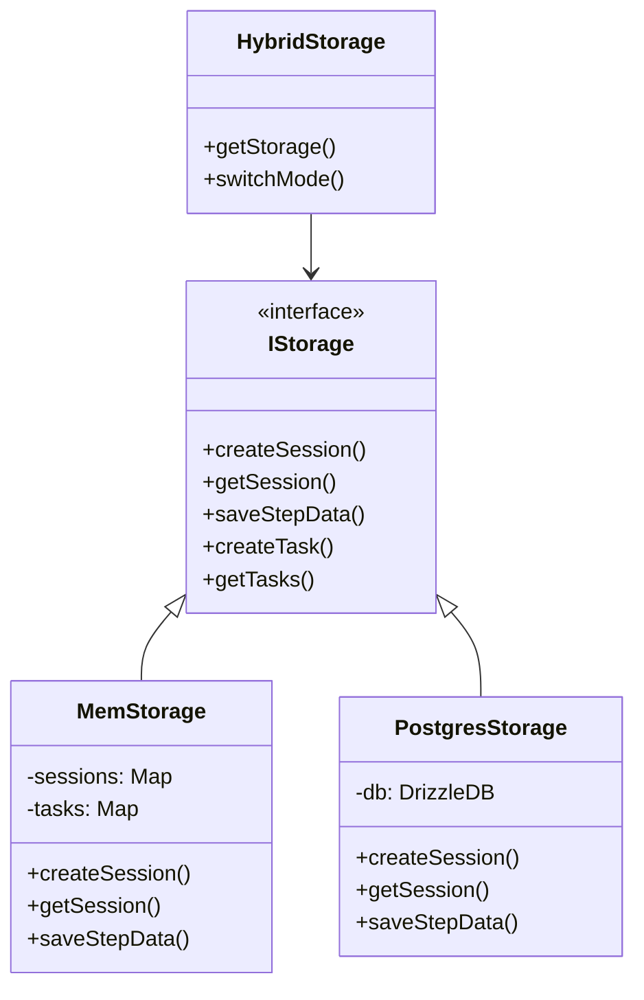
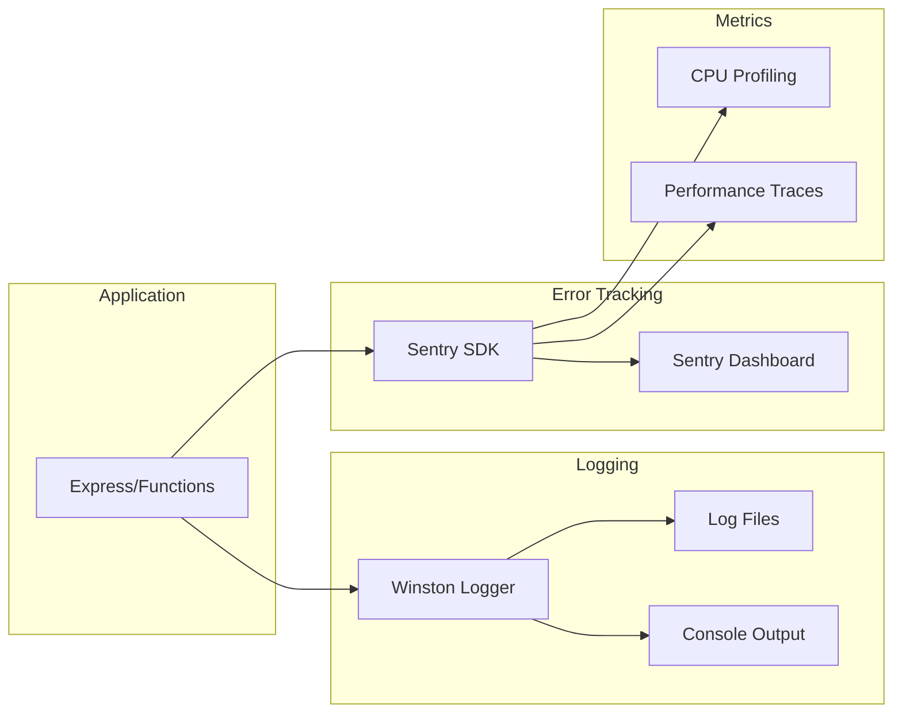
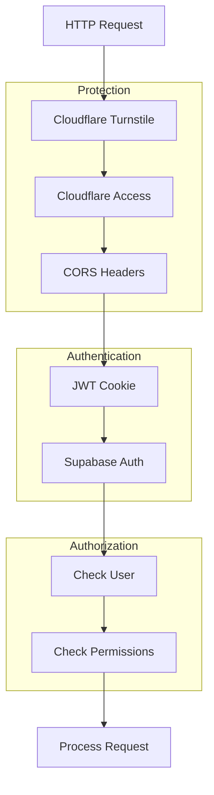

# Architecture Diagrams

## System Architecture

## Journey Flow

```mermaid
graph LR
    START[Journey Home] --> B1[Brainstorm Step 1]
    B1 --> B2[Step 2]
    B2 --> B3[Step 3]
    B3 --> B4[Step 4]
    B4 --> B5[Step 5]
    
    B5 --> C1[Choose Step 1]
    C1 --> C2[Step 2]
    C2 --> C3[Step 3]
    C3 --> C4[Step 4]
    C4 --> C5[Step 5]
    
    C5 --> O1[Objectives Step 1]
    O1 --> O2[Step 2]
    O2 --> O3[Step 3]
    O3 --> O4[Step 4]
    O4 --> O5[Step 5]
    O5 --> O6[Step 6]
    O6 --> O7[Step 7]
    
    O7 --> TASKS[Tasks Page]
    
    style B1 fill:#e3f2fd
    style C1 fill:#f3e5f5
    style O1 fill:#e8f5e9
    style TASKS fill:#fff9c4
```

## Data Flow

## Deployment Architecture

## Testing Strategy

## Storage Abstraction

## Monitoring & Observability

## Security Flow

