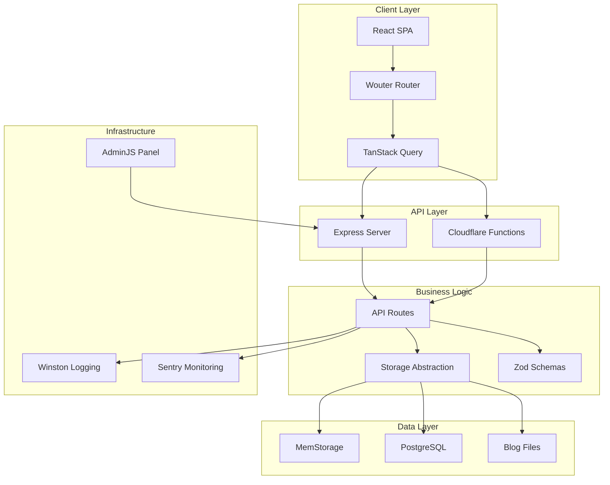
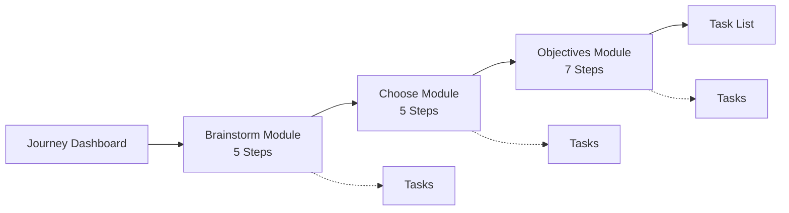
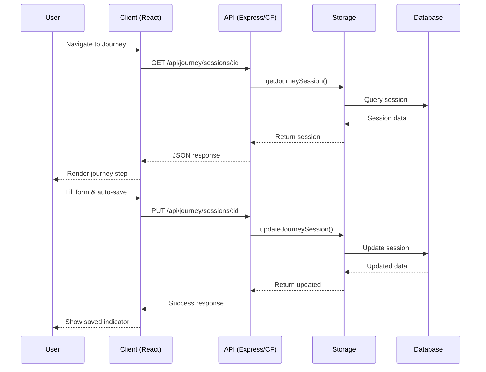
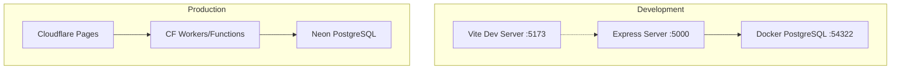
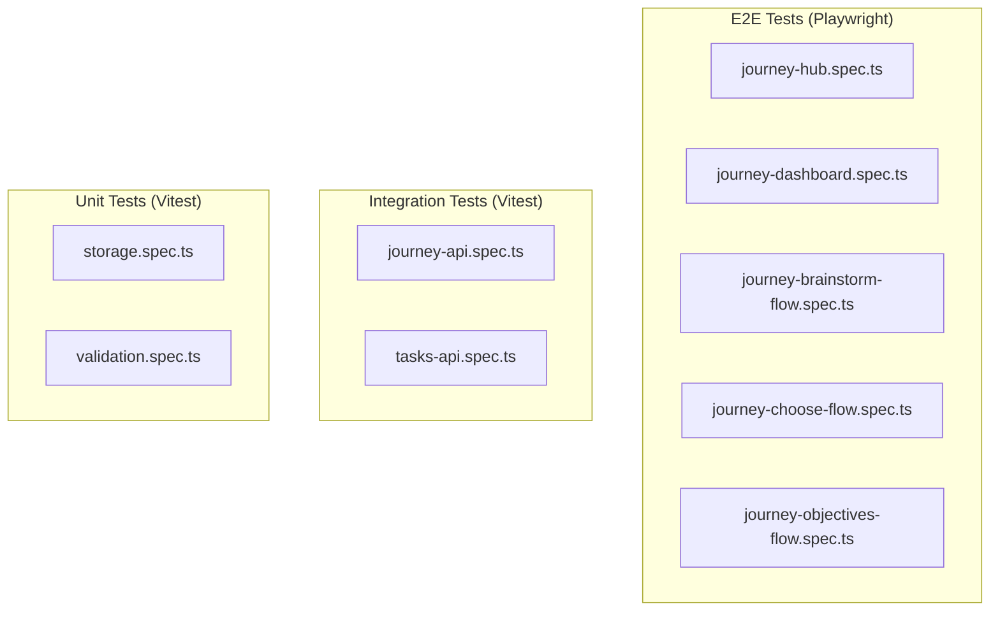
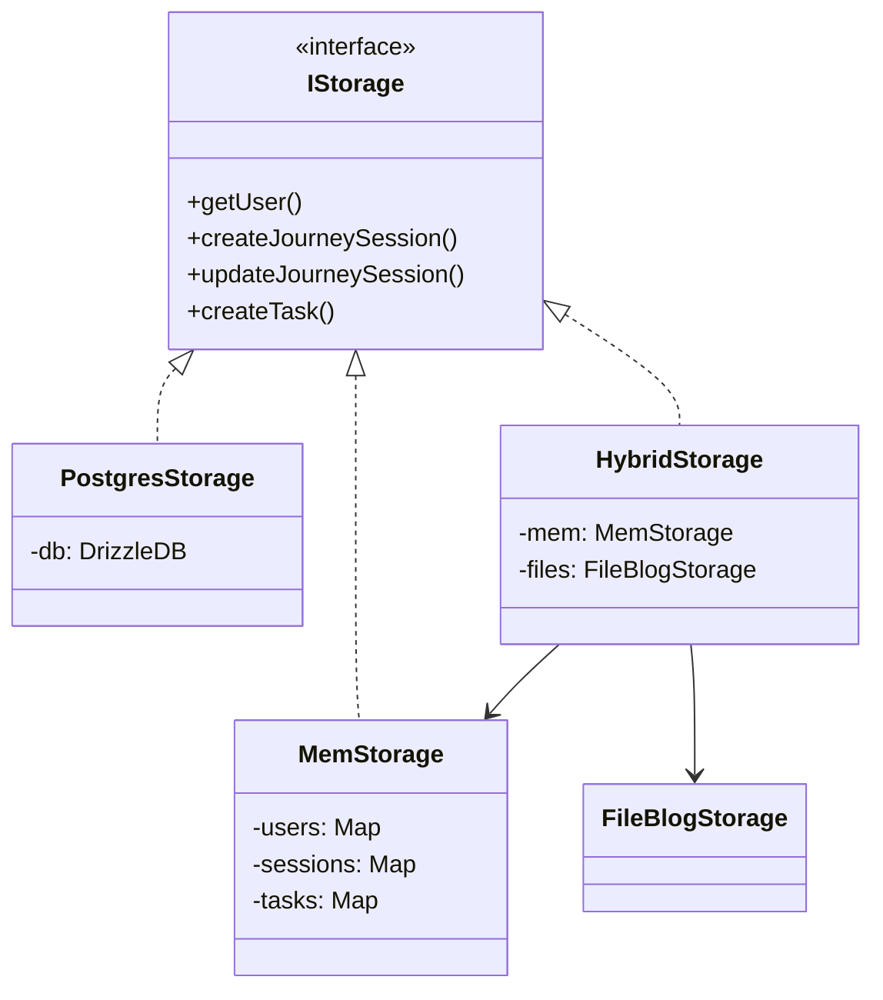
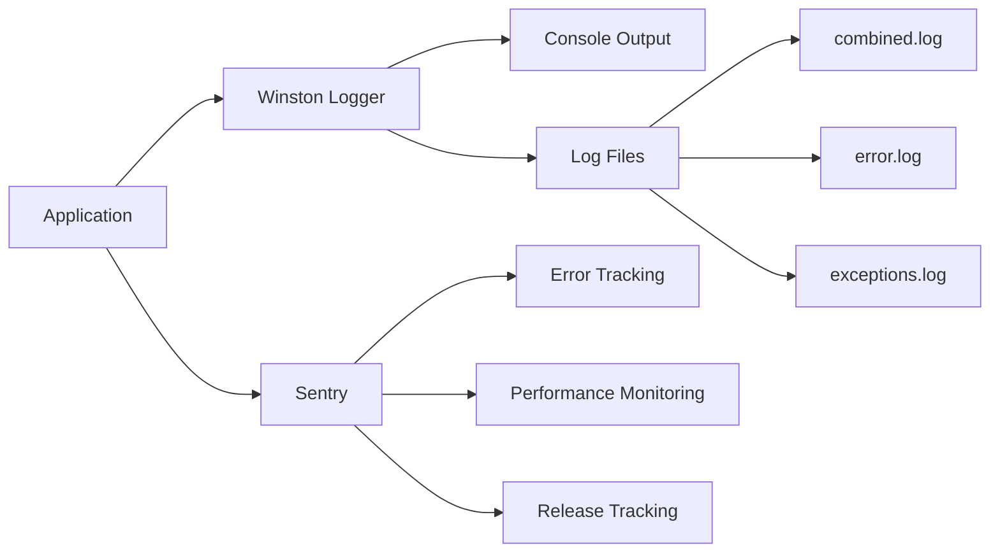

# ArrowheadSolution Architecture

## System Architecture

## Journey Flow

## Data Flow

## Deployment Architecture

## Testing Strategy

## Storage Abstraction

## Monitoring & Observability

